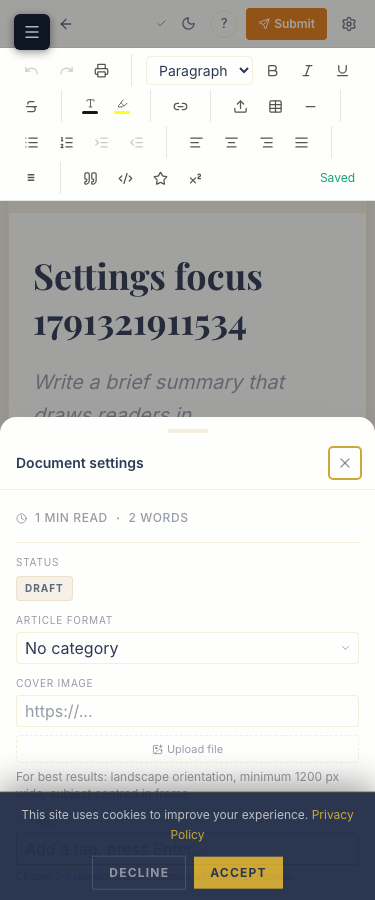

# Independent final-integration evidence

Audit date: 2026-10-06. Candidate ancestry: `72c9231` in `feature/consilium-platform-upgrade`. See [requirement ledger](../../MASTER-STATUS.md) and [release-readiness report](../../IMPLEMENTATION-REPORT.md) for scope, conclusions and remaining limits. Historical specialist claims are not acceptance evidence.

## Environment and actual commands

Node 22.23.3, Next 16.2.2, Prisma 7, Postgres 16; production Next build on localhost:3220; wire-compatible fake Storage on loopback:55620. Owned DB: `postgresql://postgres@localhost:55520/consilium`, data directory `/tmp/consilium-final-integration-pg-20261006`. These services are stopped at handoff. No production/provider acceptance is implied.

The command prefix used throughout was `/tmp/consilium-final-check.sh`, an external local helper equivalent to:

```sh
export PATH=/tmp/node-v22.23.3-darwin-arm64/bin:/opt/homebrew/opt/postgresql@16/bin:$PATH
export TEST_DATABASE_URL=postgresql://postgres@localhost:55520/consilium
export PGPORT=55520 PGDATA=/tmp/consilium-final-integration-pg-20261006
export PLATFORM_TEST_PORT=3220 PLATFORM_TEST_STORAGE_PORT=55620
cd /private/tmp/consilium-final-integration
npx ts-node -P tsconfig.seed.json scripts/platform-check.ts <command> <arguments>
```

`<command> <arguments>` above explains the wrapper, not a runnable placeholder in application code. Actual commands are listed below. `platform-check.ts` validates the DB before replacing inherited/env-file credentials, sets explicit synthetic local auth/cron/Storage credentials and disables external email/OAuth/FRED/telemetry. Rate-limiter bypass is limited to this functional harness; unit limiter checks still run. Use identical port/origin values for build/server/tests.

| Command after prefix | Acceptance log |
|---|---|
| `npm run typecheck` | [typecheck.log](typecheck.log) |
| `npm run lint` | [lint.log](lint.log) |
| `npm run test:unit` | [unit.log](unit.log) |
| `npx vitest run tests/integration --reporter=verbose` | [integration.log](integration.log) |
| `npm test -- --reporter=verbose` | [all.log](all.log) |
| `env E2E_TEAM_PROFILE=1 npx playwright test --workers=1` | [playwright.log](playwright.log) |
| `env E2E_TEAM_PROFILE=1 npx playwright test tests/e2e/upgrade-rich-content.spec.ts --workers=1` | [rich-journey-final.log](rich-journey-final.log) |
| `npx playwright test tests/e2e/upgrade-final-integration.spec.ts tests/e2e/editorial.spec.ts --grep 'slow draft\|autosaves a draft' --workers=1` | [autosave-recovery-final.log](autosave-recovery-final.log) |
| `npm run build` | [build.log](build.log) |
| `env SMOKE_BASE_URL=http://localhost:3220 npm run smoke` | [smoke.log](smoke.log): 8 unauthenticated guards passed; authenticated section not run in this standalone smoke command |
| `npm run audit:types` | [type-coverage.log](type-coverage.log) |
| `npm run audit:dead` | [dead-code.log](dead-code.log) |
| `npm run audit:dup` | [duplicates.log](duplicates.log) |

`test:integration` in package.json runs only data-layer.test.ts, so the explicit complete integration directory command was used. Tests sharing fixtures were serialized. Build logs can contain Next's caught dynamic-render diagnostics; exit status and complete route output, not a search for the word error, determine the build outcome.

## Database evidence

[setup-db.log](setup-db.log) records local schema/seeding/four additive DDL applications. [schema-inspection.log](schema-inspection.log) records actual indexes/FKs/checks/RLS. [newsletter-migration.log](newsletter-migration.log) records the revised unreleased subscriber index/function application. The full integration log includes migration replay twice, collision refusal without row deletion, and non-owner seeded-row/insert denial. [manual-db-observations.log](manual-db-observations.log) checks one subscriber after manual repeated subscription and the retained article author FK.

[repository-inventory.log](repository-inventory.log) records all three worktrees, commit ancestry, expected-failure hash provenance and unchanged explicit skip sites before the local audit commit. [marker-inventory.log](marker-inventory.log) contains the actual TODO/FIXME/debug/skip search; remaining matches are existing deliberate skips or unrelated tokens, not unresolved upgrade TODOs.

[services-handoff.log](services-handoff.log) records the owned cluster shutdown and confirms no remaining listener on the three owned QA ports.

## Failure history and targeted verification

Files ending `red.log` are deliberate failing probes, retained as evidence of defects: large-table truncation, competing review/submission, trashed scheduling/asset queue, subscriber whitespace, stale revision overwrite, off-screen settings, analytics revision changes, reduced-motion opacity, selected-period analytics and editor bounds. They are not final passing runs.

`playwright-unpublish-regression.log` has 120 pass/1 failure; `playwright-before-visual-fixes.log` has 121 pass before stronger actual-opacity acceptance. The latter does not prove reduced-motion correctness. `*-offline-not-accepted.log` are earlier runs with missing live prerequisites and are explicitly excluded; `offline-refusal.log` proves the strengthened setup now fails. `rich-journey-*-probe.log` / `rich-bounds-transition-probe.log` retain fixture/locator investigation: transient duplicate DOM during streaming navigation and an incorrectly assumed public article wrapper. Final checks target the single accessible role-based editor control (excluding temporary hidden streaming markup) and use the actual public container.

`playwright-autosave-confirmation-red.log` has 120 pass/1 failure: the first draft persisted but its acknowledgement disappeared on navigation. [autosave-persistence-probe.log](autosave-persistence-probe.log) records that actual row. `slow-draft-red.log` then reproduces newer typing replaced by the first snapshot. The added browser case holds/releases the real POST, checks the latest UI/API text, forces 503 saves and verifies retained text/unchanged DB, then retries and reloads. The existing autosave test retains its “Saved” assertion and now additionally proves 201 creation, readback and reload.

`fixes-db.log` includes a corrected transaction-mock fixture failure; it is not a final gate. Targeted passing logs (`fixes-targeted`, `scheduler-final`, `analytics-migration-final`, `analytics-reporting-final`, `cleanup-locking-final`, `final-targeted-e2e`, `visual-fixes-final`) explain intermediate repairs; final acceptance comes from the complete live suites plus final strengthened journey.

Optional Knip findings remain reported, not suppressed. Server logs include intentional negative responses, missing disabled-provider warnings and aborted navigation requests. Storage logs refer only to synthetic loopback objects. Terminal color codes/trailing whitespace are removed for diff hygiene; results and failure text are retained.

## Interaction and visual evidence

Playwright drives writer → review/edit → schedule/publish → public → replacement/deletion/republish, realistic HTML table paste, category/topic review, full shuffled team hierarchy, Growth photo/profile/permissions, discovery, subscription/share and analytics failure/privacy flows. Assertions check persistence, DOM, natural image loading, actual opacity, console/hydration diagnostics, content bounds, focus and negative responses.

Independent native Chrome interactions covered home/archive/search, team modal/Escape, writer HTML paste/table edits/metadata/Analysis/topic assignment/save/reload, mobile settings focus, Growth create/edit/reload/public placement, authorized analytics, repaired 1280px desktop editor bounds, invalid subscription (native validation), valid subscription, reloaded duplicate subscription and disabled-loading/success states. Manual Copy Link showed “Link copied!” and clipboard `https://theconsilium.co.uk/articles/bank-of-england-cuts-rates-february-2025`; supported network buttons and encoded email link were present. No external social post/email was sent. Manual browser diagnostics on those latter flows returned no app error/warning. Earlier two errors were from the unrelated Zotero extension. Native upload was blocked by the extension's file-URL permission; the permission was not expanded, and automated real upload/decoder tests provide that evidence instead.

Screenshots are from the executed local Playwright journeys, not generated mockups:

- [375px rich article](375-public-rich-article.png), [768px](768-public-rich-article.png), [1440px](1440-public-rich-article.png): real published table/figure metadata/format/topics, reduced motion, cookie overlay dismissed.
- [375px mixed team](375-mixed-team.png), [768px](768-mixed-team.png), [1440px](1440-mixed-team.png): all tiers scrolled into view, animations settled.
- [375px document settings](375-editor-settings.png), [768px](768-editor-settings.png): accessible fields, focus trap/Escape/return verified.
- [Stale editor conflict](stale-editor-conflict.png): unsaved second-tab content remains with conflict feedback.



Chromium emulation is not physical-device, Firefox/WebKit, native-share-sheet, production cron, real Supabase/CDN or external provider certification.
